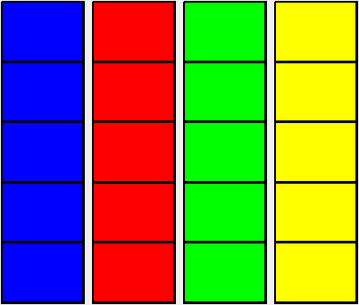
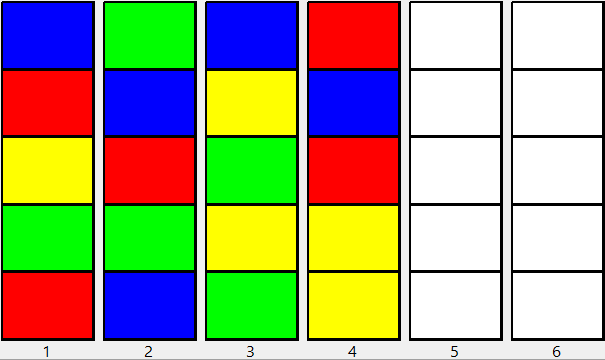
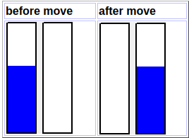
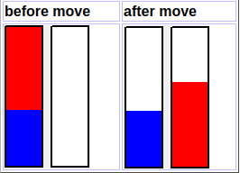
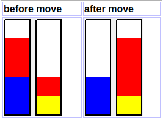
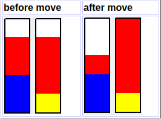

# Colour Sort Puzzles

This is my version of this [blog post](http://kociemba.org/themen/waterball/colorsort.html).

In puzzles where the aim is to sort colours into containers (like our water sort puzzle game), you have $C$ containers (or tubes) of equal size. Each container holds $N$ equal objects (or contents in our implementation) with the same colour. Different containers also differ in the colour of their contents, so there are a total of $C*N$ objects and exactly $N$ objects have the same colour.

Example with $C = 4$ and $N = 5$.



Now the objects are mixed and a number $K$ of empty containers are added, $K = 2$ in this example.



You can move objects from a source container to a destination container if the destination is empty or the source and the destination have the same top colour. There are two possible additional rules:

1. Move as many objects with the same colour from the source to the destination as possible. **This is the rule we will be using.**
2. Move just one object from the source to the destination.

The goal of the game is to undo the mixing and we have N full containers with the same colour again.

An optimal solution for the above using rule 1 is for example:

1 -> 5, 3 -> 5, 4 -> 1, 4->5, 1->4, 1->3, 2->1, 2->5, 2->6, 2->1, 2->5, 4->6, 3->4, 3->1, 3->4, 1->3, 1->6

and takes 17 moves.

In [this paper from 2022](http://kociemba.org/themen/waterball/2202.09495.pdf) it is shown that this sort of problem is NP-complete. This refers to the question of a given configuration being solvable at all and also to the question of the shortest solution if a configuration is solvable. From [Wikipedia](https://en.wikipedia.org/wiki/NP-completeness) NP-completeness has the following characteristics:

1. It is a [decision problem](https://en.wikipedia.org/wiki/Decision_problem), meaning that for any input to the problem, the output is either "yes" or "no".
2. When the answer is "yes", this can be demonstrated through the existence of a short (polynomial length) *solution*.
3. The correctness of each solution can be verified quickly (namely, in [polynomial time](https://en.wikipedia.org/wiki/Polynomial_time)) and a [brute-force search](https://en.wikipedia.org/wiki/Brute-force_search) algorithm can find a solution by trying all possible solutions.
4. The problem can be used to simulate every other problem for which we can verify quickly that a solution is correct. In this sense, NP-complete problems are the hardest of the problems to which solutions can be found quickly. If we could find solutions of some NP-complete problems quickly, we could quickly find the solutions of every other problem to which a given solution can be easily verified.

## Algorithm Description

**Assuming Rule 1 from above, so moving as many objects as possible from the source to the destination** the total number of colour blocks will never increase. In the solved position there are exactly $C$ colour blocks, while in the mixed position there are a maximum of $C*N$ colour blocks.

The example above has only 19 and not $4*5=20$ colour blocks because in container 4 two yellow objects are merged and define only one block. The following situations may occur:

1. Destination empty, one colour in source,



    This move is useless, so we don't allow it.

2. Destination empty, more than 1 colour in source:



    The number of blocks does not change

3. Destination not empty. All source blocks fit into the destination container.



    The number of blocks decreases by 1.

4. Destination not empty. Not all source blocks fit into the destination container.


    
    The number of blocks does not change.

Because only moves of type 3 decrease the number of blocks we know that if there are $B$ blocks in the initial mixed position, we have solved the puzzle if and only if we have done exactly $B-C$ moves of type 3 because there are exactly $C$ blocks left in the solved position.

## Algorithm Explanation

The algorithm uses a two dimensional array of `states[x, y]` of lists with $0<=x<=B-C$ and $y=0$ at the beginning. `states[x, y]` is the list of all puzzle positions which are reached from the initial mixed position by `x` moves which decrease the number of blocks and `y` moves which do not decrease the number of blocks. The list `states[0, 0]` contains only the start position, all other `states[x, 0]` contain an empty list. The following pseudo code shows how the other array elements are populated.

```
y = 0
solution_found = false
repeat
    new_states = 0
    for i = 0 to B - C
        states[i, y+1].Create  // Create column y+1 and initialise with empty lists
    for x = 0 to B - C - 1
        for all list elements s of states[x, y] // expand states[x, y]
            create all new possible positions p which can be generated from s with one move
            for all positions p found
                if the number of blocks decreased by one
                    add p to states[x+1, y]
                else add p to states[x, y+1]
                new_states = new_states + 1
    if states[B-C, y] is not empty
        solution_found = true
        y_0 = y
    y = y + 1
until solution_found or new_states = 0
```

If the repeat loop returns with `solution_found = false` no solution to the puzzle exists. Else we reconstruct the move sequence backwards from `states[B-C, y_0]` to `states[0, 0]` which takes $B - C + y_0$ moves.

It is important for the algorithm to assume that a move never increases the number of blocks because this would mean that new positions would be added to a list already expanded in the algorithm above. But with rile 2 exactly this might happen and we need some extra considerations in this case. This is beyond the scope of this project for now, but may be looked at in the future.

To keep the number of generated positions low, the containers within a position are sorted lexicographically. In this way the solution position for example is unique despite the fact that the locations of the empty containers are arbitrary. To prevent positions being generated multiple times we compute a hash value in the range $0 <= h < 2^{32}$ and use an array with $2^{32}$ bits to flag the positions already generated. We do not handle hash collisions which results in some generated positions which are not added to the `states` array.

The hash function itself uses random numbers for the hash value generation, so the hash collisions are different in each program run for the same initial position. I never observed different outcomes caused by the hash collisions within the limitations for the number of generated positions which are imposed by the available RAM anyway.
